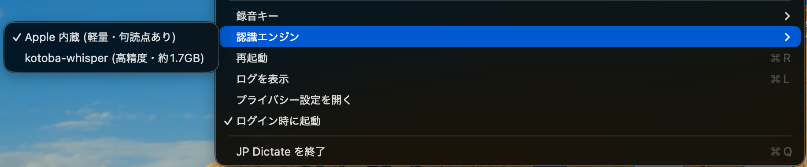

# JP Dictate

**English summary.** JP Dictate is a push-to-talk Japanese dictation app for macOS. Hold fn to record, release to paste the text at the cursor. Speech is recognized on the Mac by Apple's built-in SpeechAnalyzer, and audio never leaves the device.

- A native Swift menu-bar app; no Python or Homebrew needed
- Optional cleanup mode: hold Shift together with the record key, and only the recognized text is sent to Claude (Haiku 5.5), which fixes punctuation, removes fillers and corrects obvious typos without rewording. On a timeout or error, the raw text is pasted as is
- Restores the clipboard after pasting, and cancels when fn is pressed together with another key
- Built entirely with Claude Code
- Requires macOS 26 on Apple Silicon



The rest of this README is in Japanese.

---

macOS 用の、日本語に特化した push-to-talk 音声入力です。**fn を押している間だけ録音**し、離すとカーソル位置に貼り付けます。
認識は macOS 26 内蔵の音声認識 (SpeechAnalyzer) で、すべてこの Mac の中で行い、音声を外部に送りません。
**Shift と一緒に押して話したときだけ**、認識した文章を Claude (Haiku 5.5) で整えてから貼り付ける「清書モード」も使えます (下記)。

- Swift だけで書かれた単体のメニューバーアプリです (Dock には出ません。Python などは不要)
- fn と他のキーを同時に押したとき (fn+矢印 など) は録音を取り消します
- 貼り付けの前のクリップボードの内容 (画像なども含む) は、貼り付け後に元に戻します

## 動作環境

- macOS 26 以降、Apple Silicon
- ビルドには Xcode コマンドラインツール (`xcode-select --install`)

## ビルドとインストール

```bash
./app/build.sh          # ~/Applications/JP Dictate.app を作成して起動
```

別の Mac で使うときは、できあがった `~/Applications/JP Dictate.app` をコピーするだけで動きます
(初回は Finder で右クリック →「開く」。Apple の公証がないため)。

初回はシステム設定 → プライバシーとセキュリティ で「JP Dictate」に次の許可を与えます。

| 許可 | 用途 |
|---|---|
| 入力監視 | fn キーの検知 |
| アクセシビリティ | カーソル位置への貼り付け (⌘V の送信) |
| マイク | 録音 (最初の起動時に確認が出ます) |

システム設定 → キーボード の「🌐キーを押して」は「何もしない」にしてください (絵文字パネルなどが一緒に開くため)。

### 署名について

`app/build.sh` はキーチェーンのコード署名用証明書「JP Dictate Signing」で署名します。同じ証明書で署名する限り、
アプリを作り直しても上の許可は外れません。証明書はキーチェーンアクセス → 証明書アシスタント → 証明書を作成
(固有名の種類: 自己署名ルート、証明書のタイプ: コード署名、有効期間は長めに) で作れます。
証明書なしで ad-hoc 署名にする場合は `JPD_ALLOW_ADHOC=1 ./app/build.sh` (作り直すたびに許可が外れます)。

## 認識の性能

`eval/` の読み上げ音声 (72 文 + 複数文 24 本) での測定では、文字誤り率 4.2% (複数文 4.6%)、
読点 F1 0.67・句点 F1 0.97、キーを離してからの応答は約 70ms (複数文 145ms) でした。実際の声では変わることがあります。

## 清書モード (Claude)

録音キーを **Shift と一緒に**押して話すと (Shift は録音キーの前でも、録音中に足してもかまいません)、認識した文章を Anthropic の Claude API (`claude-haiku-5-5`) に送り、次の 3 つだけを整えてから貼り付けます。

1. 句読点 (、。？) を補う・直す
2. 「えーと」「あのー」などの言いよどみと、言い直しの前半を取り除く
3. 前後の文脈から正解が一つに決まる、1〜2 文字の明らかな誤字を直す

語尾・敬語・言い回し・表記は変えません。意味の分からない語を推測で置き換えることもしません。
時間切れ (既定 5 秒)・通信エラー・応答の拒否のときや、書き換えが大きすぎるときは、認識した文章をそのまま貼り付けます。

使い方: メニュー → 清書モード → API キーを設定… で Anthropic の API キーを入れます (この Mac のキーチェーンに保存します)。
送るのは認識した**文章だけ**で、音声は送りません。Shift なしで話したときは、これまでどおりすべてこの Mac の中で処理します。

## 設定 (環境変数)

| 変数 | 既定 | 内容 |
|---|---|---|
| `JPD_RESTORE` | 1 | 0 にすると貼り付け後にクリップボードを元に戻さない |
| `JPD_RESTORE_DELAY` | 1.5 | 貼り付けからクリップボードを戻すまでの秒数 |
| `JPD_SOUNDS` | 1 | 0 にすると開始/終了音を鳴らさない |
| `JPD_RMS_GATE` | 0.004 | 発話とみなす音量のしきい値 (30ms 単位の RMS) |
| `JPD_MIC_IDLE_SEC` | 300 | この秒数 Mac を操作しなければマイクを閉じる (0 で閉じない) |
| `JPD_LOG_TEXT` | 0 | 1 にするとログに認識した文章も書く |
| `JPD_CLEAN_TIMEOUT` | 5 | 清書モードで Claude の応答を待つ秒数 (過ぎたら認識した文章をそのまま貼り付ける) |

アプリに渡すには `launchctl setenv JPD_SOUNDS 0` などで設定してから起動し直します。

## プライバシー

- 音声は外部に送りません。録音はメモリの中だけで扱い、ディスクに書きません
- 文章も外部に送りません。例外は清書モード (Shift と一緒に押したとき) で、そのときだけ認識した文章を Anthropic の Claude API に送ります
- ログ (`~/Library/Logs/JPDictate/dictate.log`) には認識した文章を書きません
- 貼り付け用のテキストはこの Mac だけに置き (ユニバーサルクリップボードで他の端末に送らない)、
  クリップボード管理アプリには一時的な内容として知らせます。パスワード管理アプリがコピーした内容は復元しません
- パスワード入力欄 (セキュア入力中) には貼り付けません。話している間に前面のアプリが変わったときは、貼り付けずにコピーだけします
- 5 分操作がないとマイクを閉じます (マイク使用中の表示が消え、Mac がスリープできます)

## 構成

| パス | 内容 |
|---|---|
| `app/Sources/` | アプリ本体 (Swift): キー検知 `Hotkey`、録音 `Recorder`、認識 `Transcriber`、後処理 `TextCleaner`、貼り付け `Paster`、清書モード `Cleanup`、全体の流れ `Dictation`、メニュー `AppDelegate` |
| `app/build.sh` | ビルド・署名・インストール |
| `app/icon/` | アイコンの生成 (減衰振動 e^{-t/τ} sin 2πft がテキストカーソルに変わるデザイン) |
| `eval/` | 評価用の読み上げ音声の生成、ベンチマーク (`bench_one.py`)、採点 (`score.py`) |

評価の例 (アプリの実行ファイルに `--transcribe-stdin` を付けると、WAV を認識するだけのモードになります。
`--clean-stdin` を付けると、標準入力の文章を 1 行ずつ清書するモードになります。API キーは環境変数 `JPD_API_KEY` かキーチェーン):

```bash
cd eval && python3 -m venv .venv && .venv/bin/pip install numpy
python3 make_testset.py && python3 make_devset.py && .venv/bin/python make_multiset.py
python3 bench_one.py candidates/prod_swift refs.json results/prod_swift.json
python3 score.py results/*.json
```

## 著作権 / Copyright

Copyright © 2026 Elik Shima. All rights reserved.

このリポジトリのソースコードは、参考のために公開しています。利用・改変・再配布の許可（ライセンス）は付与していません。
The source code in this repository is published for reference only. No license is granted to use, modify, or redistribute it.
